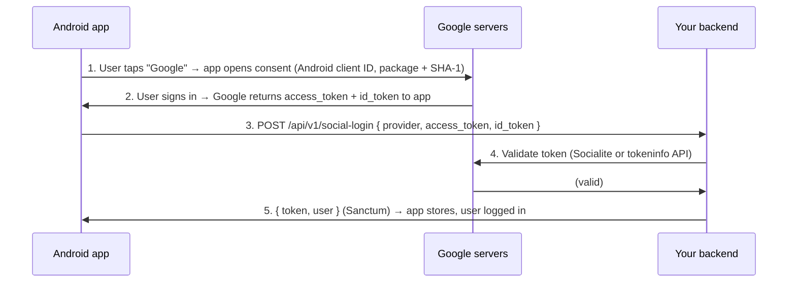

# App – Run & Build

Expo 54 (React Native) project. How to run in development and how to build development vs production.

---

## Run in development (no build)

Use this for day-to-day coding. No native build required; JS is served from Metro.

From the app folder:

```bash
cd c:\PRO\webDaiHocVN73App
npm install
npm start
```

Then:

- Press **w** for web
- Press **a** for Android (device/emulator)
- Press **i** for iOS (simulator, Mac only)

Or run a platform directly:

```bash
npm run web
npm run android
npm run ios
```

**Note:** On Android/iOS you can use **Expo Go** (from store) or a **development build** (see below) for dev menu and native modules.

---

## Development build

A **development build** is a native app that includes the Expo dev client. Use it when you need the dev menu, custom native code, or to test on a device without Expo Go.

### Option A: EAS Build (cloud)

```bash
npm install -g eas-cli
eas login
eas build:configure
eas build --platform android --profile development
eas build --platform ios --profile development
```

Ensure `eas.json` has a `development` profile (created by `eas build:configure`). Install the built APK/IPA on your device and run `npm start`; the app will connect to your Metro bundler.

### Option B: Local build (Android)

Requires **Android SDK** and `ANDROID_HOME` (see “Android SDK setup” below).

```bash
npx expo prebuild
npx expo run:android
```

This builds and runs a debug/dev build on a connected device or emulator.

---

## Production build

Use these to create builds for **web hosting** or **store distribution** (Google Play / App Store).

### Web (static export)

```bash
cd c:\PRO\webDaiHocVN73App
npx expo export --platform web
```

Output goes to `dist/`. Serve that folder with any static host (e.g. Laravel `public` or Nginx).

### Android (AAB/APK for Play Store or sideload)

**Option 1: EAS Build (recommended)**

```bash
eas build --platform android --profile production
```

```bash
eas build --platform android --profile development
```

Produces an AAB (or APK if configured) for Google Play or direct install. First run `eas build:configure` if needed.

**Option 2: Local build**

Requires **Android SDK** and `ANDROID_HOME` (see below).

```bash
$env:NODE_ENV = "production"
npx expo prebuild
cd android
.\gradlew assembleRelease
```

**APK vs AAB (Google Play):**

| Goal | Command | Output |
|------|---------|--------|
| **AAB (Google Play)** | `.\gradlew bundleRelease` | `android/app/build/outputs/bundle/release/app-release.aab` |
| **APK (sideload/testing)** | `.\gradlew assembleRelease` | `android/app/build/outputs/apk/release/` |

Google Play requires an **AAB** (Android App Bundle). Use `bundleRelease` to produce it; use `assembleRelease` only for local/testing APKs. With EAS Build (`eas build --platform android --profile production`), the downloaded artifact is typically an AAB for production.

**Release signing (required for Google Play upload):**  
Google Play rejects builds signed in debug mode. You must sign the release AAB/APK with a **release keystore**.

1. **Create a release keystore** (once per app). From the project root (PowerShell):
   ```powershell
   & "$env:JAVA_HOME\bin\keytool.exe" -genkeypair -v -storetype PKCS12 -keystore android\app\thithu-release-key.keystore -alias thithu-release -keyalg RSA -keysize 2048 -validity 10000
   ```
   Enter a store password and key password (and remember them). Keep the keystore file safe and backed up; you need it for all future updates.

2. **Configure Gradle:** In `android/gradle.properties`, uncomment and set the release signing lines (or add them):
   ```properties
   MYAPP_RELEASE_STORE_FILE=thithu-release-key.keystore
   MYAPP_RELEASE_STORE_PASSWORD=your-store-password
   MYAPP_RELEASE_KEY_ALIAS=thithu-release
   MYAPP_RELEASE_KEY_PASSWORD=your-key-password
   ```
   The store file path is relative to `android/app/`. Do not commit real passwords; use a local override or keep `gradle.properties` with secrets out of version control.

3. **Rebuild:** Run `.\gradlew bundleRelease` again. The AAB will be signed in release mode. Upload `android/app/build/outputs/bundle/release/app-release.aab` to Google Play.

**EAS Build:** If you use `eas build --platform android --profile production`, configure the production credentials in EAS (e.g. `eas credentials`) so the cloud build uses your release keystore instead of debug.

**Deobfuscation file (mapping) for Google Play:**  
When R8/ProGuard is enabled (`android.enableMinifyInReleaseBuilds=true` in `android/gradle.properties`), each release build generates a **mapping file** so Play Console can show readable stack traces for crashes and ANRs. After running `.\gradlew bundleRelease`, upload the mapping file in Play Console:

1. **Path:** `android/app/build/outputs/mapping/release/mapping.txt`
2. In **Google Play Console** → your app → **Release** → **App bundle explorer** (or the release that uses this AAB).
3. Open the release / version that matches the AAB you just uploaded.
4. Find **Deobfuscation file** or **App bundle explorer** → select the bundle → **Upload** mapping file, and upload `mapping.txt`.

Upload the mapping file that was produced by the *same* build as the AAB you uploaded (each new build has a new mapping file). This removes the warning and makes crash reports readable. If you disable minification (`android.enableMinifyInReleaseBuilds=false`), the warning can be ignored but your app will be larger and stack traces will not be obfuscated.

### iOS (App Store)

Use EAS Build (Mac or cloud):

```bash
eas build --platform ios --profile production
```

Local builds require Xcode and a Mac: `npx expo run:ios --configuration Release`.

### Android SDK setup (Windows, for local run/build)

Local Android builds need **Java (JDK 17)** and the **Android SDK**. Expo SDK 54 requires JDK 17.

#### Java (JDK 17)

1. **Install JDK 17** (pick one):
   - **Option A – winget:** `winget install Microsoft.OpenJDK.17`
   - **Option B – Manual:** Download [Microsoft Build of OpenJDK 17](https://learn.microsoft.com/en-us/java/openjdk/download#openjdk-17) or [Adoptium Eclipse Temurin 17](https://adoptium.net/) and install (e.g. to `C:\Program Files\Microsoft\jdk-17.x.x` or `C:\Program Files\Eclipse Adoptium\jdk-17.x.x`).

2. **Set JAVA_HOME and Path** (PowerShell). Replace `C:\Program Files\Microsoft\jdk-17.x.x` with your JDK install folder (e.g. after winget, look in `C:\Program Files\Microsoft\`):
   ```powershell
   [System.Environment]::SetEnvironmentVariable('JAVA_HOME', "C:\Program Files\Microsoft\jdk-17.x.x", 'User')
   $path = [System.Environment]::GetEnvironmentVariable('Path', 'User')
   $path = "%JAVA_HOME%\bin;$path"
   [System.Environment]::SetEnvironmentVariable('Path', $path, 'User')
   ```
   Then **close and reopen** the terminal. Verify: `java -version` (should show 17.x).

#### Android SDK

1. **Install Android Studio** (easiest): https://developer.android.com/studio  
   - During setup, ensure **Android SDK** is installed (default).

2. **Set environment variables** (replace path if your SDK is elsewhere):
   - `ANDROID_HOME` = `C:\Users\<You>\AppData\Local\Android\Sdk`
   - Add to **Path**: `%ANDROID_HOME%\platform-tools` and `%ANDROID_HOME%\emulator`

   **PowerShell (current user):**
   ```powershell
   [System.Environment]::SetEnvironmentVariable('ANDROID_HOME', "$env:LOCALAPPDATA\Android\Sdk", 'User')
   $path = [System.Environment]::GetEnvironmentVariable('Path', 'User')
   $path += ";$env:LOCALAPPDATA\Android\Sdk\platform-tools;$env:LOCALAPPDATA\Android\Sdk\emulator"
   [System.Environment]::SetEnvironmentVariable('Path', $path, 'User')
   ```
   Then **close and reopen** PowerShell/terminal.

3. **Verify:** `adb version` should run without error.

4. **Run app:** `npx expo run:android` (or start with `npx expo start` and press **a** with an emulator/device connected).

---

## API / Auth

Protected endpoints (e.g. `GET /api/v1/user`) require the **Bearer token** in the request:

- **In the app:** The API client sends `Authorization: Bearer <token>` automatically (token is read from storage on each request).
- **Testing in browser or Postman:** Opening `http://localhost:8000/api/v1/user` without the header returns `{"message":"Unauthenticated."}`. To test:
  1. Log in via `POST /api/v1/login` with `email` and `password`.
  2. Use the returned `token` in the header: `Authorization: Bearer <token>`.

In dev, the console logs each request as `(with auth)` or `(no auth)` so you can confirm the token is sent.

---

## Google OAuth (web – “redirect_uri doesn’t comply”)

When you sign in with Google on **web** (e.g. `npm run web` at `http://localhost:8081` or `8082`), Google requires the **exact** redirect URI to be registered in the Google Cloud Console. If it isn’t, you’ll see:

> You can't sign in to this app because it doesn't comply with Google's OAuth 2.0 policy. Register the redirect URI in the Google Cloud Console.  
> Request details: redirect_uri=http://localhost:8082/oauthredirect

**Fix:**

1. Open [Google Cloud Console](https://console.cloud.google.com/) → your project → **APIs & Services** → **Credentials**.
2. Open the **OAuth 2.0 Client ID** you use for **web** (the one whose Client ID is in `EXPO_PUBLIC_GOOGLE_WEB_CLIENT_ID`). If you only have an Android/iOS client, create a new **Web application** client and use its Client ID for web.
3. Under **Authorized redirect URIs**, add:
   - **Local dev:**  
     `http://localhost:8081/oauthredirect`  
     `http://localhost:8082/oauthredirect`  
     (add the port(s) you actually use; Metro often uses 8081, sometimes 8082).
   - **Production:**  
     `https://your-domain.com/oauthredirect`  
     (replace with your real web URL).
4. Save. The redirect URI in the app (e.g. `http://localhost:8082/oauthredirect`) must **match exactly** what you added (including path `/oauthredirect` and no trailing slash).

The app uses `expo-auth-session`’s `makeRedirectUri({ path: 'oauthredirect' })` on web, so the redirect URI is always `{origin}/oauthredirect` (e.g. `http://localhost:8082/oauthredirect`). Register that full URL in the Console.

---

## Google OAuth (Android app)

The **backend** (`../webDaiHocVN73`) accepts Google sign-in via **POST /api/v1/social-login** with `provider: 'google'` and either `access_token` or `id_token` (or both). The app sends both when available; on Android, Google often returns `id_token`, which the backend validates with `https://oauth2.googleapis.com/tokeninfo`. No backend config change is needed for Android.

**App side:**

- **Package name:** `com.daihoc.vn1.webDaiHocVN73App` (from `app.json` → `android.package`).
- **Redirect URI** (used by expo-auth-session on native): `com.daihoc.vn1.webDaiHocVN73App://oauthredirect` (use **double slash** `://` so **Android** opens the app after sign-in; single slash can leave the user on Google’s “One moment please...” with no redirect back — this affects the **Android client** and is fixed by using `makeRedirectUri({ native: '...://oauthredirect' })` in the app).
- **Env:** set `EXPO_PUBLIC_GOOGLE_ANDROID_CLIENT_ID` to the **Android** OAuth client ID from Google Cloud Console.

**Google Cloud Console (Android):**

1. [Google Cloud Console](https://console.cloud.google.com/) → your project → **APIs & Services** → **Credentials**.
2. Create (or edit) **one** Android OAuth 2.0 Client ID (you do **not** create a second app):
   - **Application type:** Android.
   - **Package name:** `com.daihoc.vn1.webDaiHocVN73App`.
   - **SHA-1 certificate fingerprint:** the same client can have **multiple** SHA-1 values. Add the first (e.g. debug), then use **Add fingerprint** (or **+ Add SHA-1**) to add the second (e.g. release). If the UI shows only one text box, add the first SHA-1 and **Save**, then **Edit** the client again and you should see an option to add another fingerprint.
     - **Debug:** from your debug keystore (e.g. `keytool -keystore ~/.android/debug.keystore -list -v`, password `android`; or from Android Studio). On Windows: `keytool -keystore %USERPROFILE%\.android\debug.keystore -list -v -storepass android -keypass android`.
     - **Release:** from the keystore you use to sign the release build (e.g. `keytool -keystore android/app/thithu-release-key.keystore -list -v`).

     ```bash
     & "C:\Program Files\Java\jdk-21.0.10\bin\keytool.exe" -genkeypair -v -storetype PKCS12 -keystore android\app\thithu-release-key.keystore -alias thithu-release -keyalg RSA -keysize 2048 -validity 10000
     ```
3. Save. You do **not** add redirect URIs for the Android client type; Google uses package name + SHA-1.

**Backend (.env in webDaiHocVN73):**  
`GOOGLE_CLIENT_ID` and `GOOGLE_CLIENT_SECRET` are for the **Web** client (used by Laravel Socialite and by the tokeninfo fallback for `id_token`). The Android client ID is only used inside the app; the backend only needs the web client credentials.

---

## Google Sign-In flow (Android): how it works

This section explains the flow between the **Android app**, **Google’s servers**, and **your backend**, and what you need for production.

### End-to-end flow (Android → Google → your backend)



1. **User taps “Sign in with Google”** in the app.
2. **App opens Google consent** (in-app or browser). The app uses the **Android** OAuth client ID; Google identifies the app by **package name + SHA-1** (no redirect to your backend).
3. **User signs in at Google.** Google returns `access_token` and/or `id_token` **to the app** (not to your server).
4. **App sends tokens to your backend:** `POST /api/v1/social-login` with `provider: 'google'`, `access_token`, and/or `id_token`.
5. **Backend validates the token** with Google (Socialite for `access_token`, or `https://oauth2.googleapis.com/tokeninfo` for `id_token`), then finds or creates the user and issues a Sanctum token.
6. **App receives `{ token, user }`**, stores them, and the user is logged in.

So: **Android app ↔ Google** uses the **Android** OAuth client (package name + SHA-1). **App ↔ backend** sends the tokens; **backend ↔ Google** uses the **Web** client to validate them. Google never redirects to your backend for the Android flow.

### Implementation review (app + backend)

Both the frontend app and the Laravel backend implement this flow as follows.

| Step | App (this repo) | Backend (C:\PRO\webDaiHocVN73) |
|------|-----------------|---------------------------------|
| **1–2. Open consent, get tokens** | `LoginScreen.js` / `RegisterScreen.js`: `useAuthRequest` with `androidClientId`, `redirectUri`; `promptAsync()`; read `response.params.access_token` and `response.params.id_token` (or `response.authentication`). | — |
| **3. POST tokens to backend** | `AuthContext.js`: `socialLogin(provider, accessToken, idToken)` builds `{ provider, access_token?, id_token? }` and calls `apiClient.post('/api/v1/social-login', body)`. `src/api/client.js`: base URL from `EXPO_PUBLIC_API_BASE_URL`, JSON body. | `routes/api.php`: `POST /api/v1/social-login` → `AuthController@socialLogin`. |
| **4. Validate with Google** | — | `AuthController.php` `socialLogin()`: first tries `Socialite::driver($provider)->userFromToken($request->access_token)`; if that fails and `id_token` is present (Google), calls `https://oauth2.googleapis.com/tokeninfo?id_token=...` and builds user from payload. |
| **5. Return token + user** | — | `AuthController.php`: finds or creates user, then `$user->createToken('api-v1')->plainTextToken`; returns `{ token, token_type: 'Bearer', user }`. |
| **Store and log in** | `AuthContext.js`: on success, `authStorage.setToken(t)`, `authStorage.setUser(u)`, `setAuth(t, u)`. | — |

**Verified:** Frontend sends `provider`, `access_token`, and/or `id_token`; backend requires at least one token, validates with Google (Socialite or tokeninfo), and returns Sanctum `token` and `user`; app stores both and treats the user as logged in. No gaps in the flow.

### Who uses which credentials

| Role | Uses | Purpose |
|------|------|--------|
| **Android app** | **Android** OAuth client ID (`EXPO_PUBLIC_GOOGLE_ANDROID_CLIENT_ID`) | So Google shows consent and returns tokens to this app (identified by package name + SHA-1). |
| **Google** | **Android** OAuth client: package name + **SHA-1** (debug and/or release) | Ensures the app requesting tokens is really yours. Wrong or missing SHA-1 → “Sign in with Google” can fail. |
| **Backend** | **Web** OAuth client (`GOOGLE_CLIENT_ID`, `GOOGLE_CLIENT_SECRET`) | Validates `access_token` (Socialite). For `id_token` it can use tokeninfo (no secret). |

You do **not** create a separate “app” in Play Console for this; you add the **Android** client in Google Cloud and register both SHA-1s there (see “Google OAuth (Android app)” above).

### What to do for production

- **Google Cloud Console → Android OAuth client:** Package name `com.daihoc.vn1.webDaiHocVN73App`. Add **release** SHA-1 (from Play Console → App integrity, or from your release keystore). Add **debug** SHA-1 if you still test debug builds.
- **App:** Set `EXPO_PUBLIC_GOOGLE_ANDROID_CLIENT_ID` to the **Android** client ID (e.g. via EAS Secrets or build env). Sign the production build with your **release** keystore so the SHA-1 matches.
- **Backend:** `.env` has `GOOGLE_CLIENT_ID` and `GOOGLE_CLIENT_SECRET` for the **Web** client (for token validation). No backend change needed for the “Android client” — that is only for app ↔ Google.
- **After uploading to Play:** If you use Play App Signing, get the **SHA-1 from Play Console → App integrity** and add it to the same **Android** OAuth client so production installs from Play are allowed.

---

## Google OAuth 2.0 best practices (compliance check)

Per [Google’s OAuth 2.0 best practices](https://developers.google.com/identity/protocols/oauth2/resources/best-practices):

| Practice | Status | Notes |
|----------|--------|--------|
| **Client credentials secure** | ✅ | App: client IDs from env (`EXPO_PUBLIC_GOOGLE_*`), not hardcoded. Backend: `GOOGLE_CLIENT_ID` and `GOOGLE_CLIENT_SECRET` from `.env` (gitignored). Never commit secrets. |
| **User tokens secure** | ✅ | App stores **Sanctum** token (and user/credentials) in **expo-secure-store** on Android/iOS (Keystore/Keychain); on web falls back to AsyncStorage. Google tokens are not stored. Backend revokes token on logout. See `src/auth/storage.js`. |
| **Refresh token handling** | ✅ | App does not store Google refresh tokens; backend issues Sanctum tokens. Logout revokes current access token (`AuthController@logout`). |
| **Incremental authorization** | ✅ | Only `profile` and `email` scopes requested, and only for sign-in. No extra scopes requested up front. |
| **Multiple scopes / consent** | ✅ | Single minimal scope set; no handling needed for partial consent. |
| **Secure browser (no WebView)** | ✅ | `expo-auth-session` uses **Chrome Custom Tabs** on Android (via `expo-web-browser`), not an embedded WebView. Aligns with “use native OAuth libraries or platform Sign-in” guidance. |
| **OAuth clients created in Console** | ✅ | Clients are created and configured in Google Cloud Console, not programmatically. |
| **Remove unused clients** | — | Periodically audit Google Cloud Credentials and delete unused OAuth clients. |

Summary: Client credentials and server-side secrets are handled correctly; token storage on the app is acceptable with an optional improvement (secure store). OAuth flow uses a proper browser (Custom Tabs), minimal scopes, and token revocation on logout.

---

## Action items: Google auth before publishing

Complete these before publishing the app (Play Store, App Store, or production web).

### Google Cloud Console

- [ ] **OAuth consent screen** (APIs & Services → OAuth consent screen): App name, support email, and (if External) add production domain; complete verification if going past 100 users or sensitive scopes.
- [ ] **Web OAuth client** (Credentials → Create → OAuth client ID → Web application):
  - [ ] Add **Authorized redirect URIs**: `https://your-production-domain.com/oauthredirect` (replace with real production web URL).
  - [ ] Keep dev URIs if needed: `http://localhost:8081/oauthredirect`, `http://localhost:8082/oauthredirect`.
- [ ] **Android OAuth client** (Credentials → Create → OAuth client ID → Android):
  - [ ] Package name: `com.daihoc.vn1.webDaiHocVN73App`.
  - [ ] Add **SHA-1** for **release** signing key (from Play Console → App integrity / App signing, or from your release keystore).
  - [ ] Add **SHA-1** for **debug** if you test with debug builds.
- [ ] **iOS OAuth client** (if publishing to App Store): Create iOS client with your app’s bundle ID and use that Client ID in the app.

### App (this repo)

- [ ] **.env (or EAS Secrets)** for production builds: set `EXPO_PUBLIC_GOOGLE_WEB_CLIENT_ID`, `EXPO_PUBLIC_GOOGLE_ANDROID_CLIENT_ID`, and (if iOS) `EXPO_PUBLIC_GOOGLE_IOS_CLIENT_ID` to the Client IDs from the steps above.
- [ ] **Production web**: Ensure the domain you deploy to is the one added as redirect URI in the Web client (e.g. `https://your-domain.com/oauthredirect`).

### Backend (../webDaiHocVN73)

- [ ] **.env**: `GOOGLE_CLIENT_ID` and `GOOGLE_CLIENT_SECRET` set to the **Web** OAuth client’s Client ID and Client Secret (same project as the app clients).
- [ ] **GOOGLE_REDIRECT** (optional): If the backend does server-side Google OAuth for web, set `GOOGLE_REDIRECT` to your backend callback URL (e.g. `https://your-api.com/login/google/callback`). The mobile app uses token-based social-login only and does not depend on this.

### After publishing

- [ ] Test **Sign in with Google** on production web and on a production (or internal testing) Android build; fix any redirect_uri or SHA-1 errors using the “Google OAuth (web)” and “Google OAuth (Android app)” sections above.

---

## Summary

| Goal                | Command / step                                                |
|---------------------|---------------------------------------------------------------|
| Run in dev          | `npm start` then w / a / i                                    |
| Development build   | `eas build --profile development` or `npx expo run:android`  |
| Production – web   | `npx expo export --platform web` → serve `dist/`              |
| Production – Android | `eas build --platform android --profile production` or local `assembleRelease` / `bundleRelease` |
| Production – iOS   | `eas build --platform ios --profile production`               |

### Run on your Android phone (summary)

1. **Expo Go (quick test):** `npm start` → press **a** → open **Expo Go** on the phone and scan the QR code. Phone and PC must be on the same Wi‑Fi.
2. **Development build (recommended for Google Sign-In, dev menu):**
   - **EAS (cloud):** `eas build --platform android --profile development` → download APK from the build link → install on phone → on PC run `npm start` → open the installed app (same Wi‑Fi).
   - **Local:** Set `ANDROID_HOME`, connect phone via USB, then `npx expo prebuild` and `npx expo run:android`.

---

## Google Sign-In (OAuth)

To enable **Đăng nhập / Đăng ký bằng Google** you need OAuth 2.0 client IDs from Google Cloud and to set them in `.env`.

### 1. Create a project and OAuth consent (if needed)

1. Open [Google Cloud Console](https://console.cloud.google.com/).
2. Create a project or select an existing one.
3. Go to **APIs & Services** → **OAuth consent screen**.
4. Choose **External** (or Internal for workspace-only), set app name and support email, add your email as test user if in testing mode. Save.

### 2. Create OAuth client IDs

Go to **APIs & Services** → **Credentials** → **Create credentials** → **OAuth client ID**.

Create **three** client IDs (one per application type):

| Application type | Use for | Where to use |
|------------------|--------|----------------|
| **Web application** | Web build + Expo auth flow | `EXPO_PUBLIC_GOOGLE_WEB_CLIENT_ID` |
| **iOS** | iOS app / Expo Go on iOS | `EXPO_PUBLIC_GOOGLE_IOS_CLIENT_ID` |
| **Android** | Android app / Expo Go on Android | `EXPO_PUBLIC_GOOGLE_ANDROID_CLIENT_ID` |

- **Web**: Create “Web application”. Add **Authorized redirect URIs** if your backend or Expo requires them (e.g. Expo’s redirect). Copy the **Client ID** (ends in `.apps.googleusercontent.com`).
- **iOS**: Create “iOS”. Enter your **iOS bundle ID** (e.g. from `app.json` / EAS: `com.yourapp.name`). For Expo Go use the Expo Go bundle ID (see [Expo Google auth docs](https://docs.expo.dev/guides/authentication/#google)). Copy the **Client ID**.
- **Android**: Create “Android”. Enter **Package name** (e.g. from `app.json`: `com.yourapp.name`) and the **SHA-1** of your signing key.

#### Getting SHA-1 for Android

For the **build you are testing**, use the matching SHA‑1:

- **Debug build (local / dev build)** – from your **debug keystore**:

  ```bash
  # Windows PowerShell (uses default debug.keystore)
  & "$env:JAVA_HOME\bin\keytool.exe" -list -v -keystore "$env:USERPROFILE\.android\debug.keystore" -storepass android -keypass android
  ```

  Then copy the `SHA1:` fingerprint from the output into the Android OAuth client.

- **Play Store / production build** – from **Play Console**:
  1. Open **Google Play Console** → your app.
  2. Go to **Setup** → **App integrity** (or **App signing**).
  3. In the **App signing key certificate** section, copy the **SHA-1** fingerprint.
  4. Paste this SHA‑1 into the Android OAuth client in Google Cloud Console.

### 3. Set variables in `.env`

Copy `.env.example` to `.env` (if you haven’t) and set:

```env
EXPO_PUBLIC_GOOGLE_WEB_CLIENT_ID=123456789-xxxx.apps.googleusercontent.com
EXPO_PUBLIC_GOOGLE_IOS_CLIENT_ID=123456789-yyyy.apps.googleusercontent.com
EXPO_PUBLIC_GOOGLE_ANDROID_CLIENT_ID=123456789-zzzz.apps.googleusercontent.com
```

At least **Web client ID** is required; iOS and Android IDs are needed for native/Expo Go on those platforms. Restart Metro (`npm start`) after changing `.env`.

### 4. Backend

Your Laravel backend must accept Google tokens (e.g. `POST /api/v1/social-login` with `provider: 'google'` and `access_token`) and create or log in the user. Ensure the same Google project and client IDs are allowed in the backend if it validates the token.
